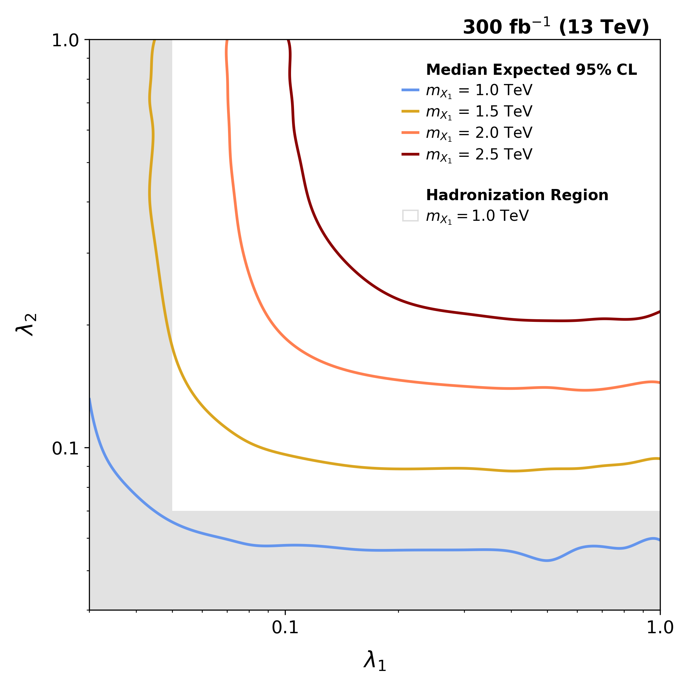

# Higgs Combine Tool
This directory contains the HiggsCombine setup and datacard-based limit-setting workflow.

## Setup

### HiggsCombine Tool Setup

`CMSSW` is needed for this task.
```
source /cvmfs/cms.cern.ch/cmsset_default.sh
cmsrel CMSSW_14_1_0_pre4
```

before running `HiggsCombine` tools, below commands are required.
```
# At current directory
source /cvmfs/cms.cern.ch/cmsset_default.sh
# At ./CMSSW_14_1_0_pre4/src
cmsenv
```

## Running AsymptoticLimits

Run `run_asymptotic_card-all.sh` to compute AsymptoticLimits and obtain the expected upper limit on the signal strength r.

For example, to obtain the r-value upper limit for MX1 = 1.0 TeV with statistical uncertainty only:
```
lumi=300 # Run3, 300 fb-1
mode=stats # statistical uncertainty as gaussian constraint with log-normal are applied
DC="./datacards/datacard_lumi${lumi}_mx11-0_cut${c10}_${mode}.txt"
echo "[RUN] ${DC}"
combine -M AsymptoticLimits $DC \
    -n .Lumi${lumi}.MX10.${mode} \
    -m 1000 \ # mX1 = 1.0 TeV = 1000 GeV, just for root file prefix
    --run expected
```
For the `$mode` are considered as
- none : without statistical uncertainties
- stats : with statistical uncertainties
- sys1 : + 10% signal cross-section uncertainty for signal side
- sys2 : + 5% JES uncertainties for signal and background both side
- sys3 : + 4% MET uncertainties for signal and background both side
In detail, you can check the modes in the folder `datacards`

The datacard referenced by $DC in the example above has the following format (Run3 Lumi, $m_{X_1}$=1.0TeV, mode=stats):
```
imax 1  number of channels
jmax 1  number of backgrounds
kmax *
----------------------------------------------------------------------
bin         bin1
observation 46930
----------------------------------------------------------------------
bin                      bin1                bin1
process                  sig                 bkg
process                  0                   1
rate                     4638.0954           46929.5125
----------------------------------------------------------------------
stat_bkg        lnN     -                   1.0120
```
Note that if the line `observation 46930` is omitted in the `datacard` as input to Combine, you would see the warning `No observed data 'data_obs' in the workspace. Cannot compute limit.`.

As a result,
- (1) it print-out the expected signal strength r
- (2) and make **output root file** names `higgsCombine.Lumi300.MX10.stats.AsymptoticLimits.mH1000.root`
```
=============================================================
 lumi=300  mode=stats
============================================================
[RUN] ./datacards/datacard_lumi300_mx11-0_cut0p1050_stats.txt
Expected  2.5%: r < 0.2031
Expected 16.0%: r < 0.2699
Expected 50.0%: r < 0.3740
Expected 84.0%: r < 0.5201
Expected 97.5%: r < 0.6913
```
In above, `Expected 50.0%` r-value is used for calculating the upper limit on the parameter space.
Following procedure, **the output root file** is used for getting r-value

If use `observed` run mode instead of `expected` run mode, you can see the observed r value as
```
Observed Limit: r < 0.3749
```
with `run_asymptotic_w-observed_card-all.sh` run script


## Analysis
It is performed in the `./result` folder. the results are processed by following procedures

### Step1 (`run_step1.sh`)
- `run_step1.sh` is run-script for `step1_make-table.py`
- which makes `resultcard_expected.txt` as summary table (markdown-style table)
- by parsing `median expected r` from **output root files**.
- Below tables are summary of **expected median r** for integrated luminosity=300 fb⁻¹, for all run-mode and $m_(X_1)$ mass-point with Run3 luminosity.

| $M_{X_1}$ [TeV] |  none  | stats  |  sys1  |  sys2  |  sys3  |
| :-------------: | :----: | :----: | :----: | :----: | :----: |
|       1.0       | 0.2920 | 0.3740 | 0.3809 | 1.1055 | 1.3984 |
|       1.5       | 0.8086 | 0.9375 | 0.9531 | 1.3672 | 1.5859 |
|       2.0       | 2.0078 | 2.2891 | 2.3203 | 2.6953 | 2.9141 |
|       2.5       | 4.6094 | 5.1094 | 5.2031 | 5.5312 | 5.7344 |

### Step2 (`run_step2.sh`)
- `run_step2.sh` is run-script for `step2_plot-expected-contour.py`
    - (1) print-out for $\lambda_{i}$ critical values when $\lambda_{j}$=0.5 $(i,j=1,2, i \neq j)$ and
    - (2) make contour plots in the folder `plots_expected` varying luminosity scenarios and uncertainty mode.
    - For details about scripts, please check to [Converting r-value to coupling upper limit](#converting-r-value-to-coupling-upper-limit).
- below tables are one of the example for the case of Run3 Luminosity and statistical uncertainty considered only
- below figure is contour plot for the same case.

| MX1 | lam1_crit (fixed lam2=0.5) | lam2_crit (fixed lam1=0.5) |
|---|---|---|
| 1.0 | <0.03 | 0.054 |
| 1.5 | 0.043 | 0.088 |
| 2.0 | 0.072 | 0.139 |
| 2.5 | 0.109 | 0.204 |



### Converting r-value to coupling upper limit

- The r-value from HiggsCombine is the 95% CL upper limit on the signal strength modifier μ.
- In current procedures, this analysis scans the full two-dimensional $(\lambda_1,\lambda_{2})$ coupling space using 
- luminosity-scaled signal yields obtained directly from the BDT-cut output.
    - The file `src/BDT_cut/out/FINAL/v2_2500_4_0p1050/sig_lumi300_mx11-0.csv`[(link)](src/BDT_cut/out/FINAL/v2_2500_4_0p1050/sig_lumi300_mx11-0.csv)
    - contains the remaining signal yield at each $(\lambda_1,\lambda_2)$ grid point after applying the BDT cut(0.1050 in this case), for the Run 3 luminosity scenario and the $m_{X_1}=1.0\,\mathrm{TeV}$ BDT model.

#### Excluded signal yield

The nominal signal yield $N_s^\mathrm{nominal}$ is read from the datacard `rate` line:

$$N_s^{\rm nominal} = \sigma(\lambda_1^{\rm ref}, \lambda_2^{\rm ref}) \times \mathcal{L} \times \varepsilon_s^{\rm ref}$$

- where the reference coupling is $(\lambda_{1}^{\mathrm{ref}},\lambda_{2}^\mathrm{ref})$ = (0.1, 0.1) and
- $\epsilon^\mathrm{ref}_{s}$ is the combined selection and BDT efficiency at that point.

The 95% CL excluded signal yield is then:

$$N_s^{\rm excl} = r_{\rm up} \times N_s^{\rm nominal}$$

In code (`step2_plot-expected-contour.py`):
```python
s0 = get_s0_from_datacard(card)      # reads 'rate' line → N_s^nominal
s_up = r_val * s0                    # N_s^excl
```

#### Signal-yield plane over $(\lambda_{1},\lambda_{2})$

For each coupling grid point $(\lambda_{1},\lambda_{2})$, the actual signal yield after the BDT cut is read from `sig_lumi{lumi}_mx1{mx1}.csv` (column `sg after`):
$$N_s(\lambda_1, \lambda_2) = \sigma(\lambda_1, \lambda_2) \times \mathcal{L} \times \varepsilon_s(\lambda_1, \lambda_2)$$
This yield is already luminosity-scaled to the target integrated luminosity (300 or 3000 fb⁻¹)

The grid covers:
- $\lambda_{1}$ $\in$ {0.03, 0.05, 0.07, 0.08, 0.10, 0.15, 0.20, 0.30, 0.40, 0.50, 0.60, 0.70, 0.80, 0.90, 1.00}
- $\lambda_{1}$ $\in$ {0.04, 0.06, 0.08, 0.10, 0.15, 0.20, 0.30, 0.40, 0.50, 0.60, 0.70, 0.80, 0.90, 1.00}
The result is a 2D matrix (plane) indexed by $(\lambda_{1},\lambda_{2})$, which is then interpolated with a cubic spline (`RectBivariateSpline`) at 100× finer resolution.

In code:
```python
plane = build_plane(sig_csv, mx1, lam1_list, lam2_list, col="sg after")
XI, YI, ZI = interpolate_plane_str(plane)   # cubic spline × 100
```

#### Exclusion contour

The 95% CL exclusion boundary in the (λ₁, λ₂) plane is the iso-yield contour:

$$N_s(\lambda_1, \lambda_2) = N_s^{\rm excl} = r_{\rm up} \times N_s^{\rm nominal}$$

The region where $N_s(\lambda_{1},\lambda_{2}) > N_s^\mathrm{excl}$ is **excluded at 95% CL**.
The contour is drawn with `matplotlib.axes.Axes.contour` at `levels=[s_up]`.

In code:
```python
cs = ax.contour(XI, YI, ZI, levels=[s_up], colors=[color], linewidths=2.0)
```

#### Critical coupling values (1D slices)

To quote a single number per mass point, 1D slices through the contour are taken
by fixing one coupling at its reference value and scanning the other:

| Slice       | Fixed    | Scanned | Interpolation                                         |
| ----------- | -------- | ------- | ----------------------------------------------------- |
| $\lambda_1$ critical | λ₂ = 0.5 | $\lambda_1$      | `interp1d($N_s$, $\lambda_1$)` → solve $N_s = N_s^\mathrm{excl}$ |
| $\lambda_2$ critical | λ₁ = 0.5 | $\lambda_2$      | `interp1d($N_s$, $\lambda_2$)` → solve $N_s = N_s^\mathrm{excl}$ |

<!-- 
#### Luminosity treatment

Because both N_s(λ₁, λ₂) and N_s^nominal are scaled to the **same** luminosity L,
the contour condition is mathematically L-independent (L cancels).
Luminosity enters the result only through r_up, which is obtained by running
HiggsCombine separately with datacards built for each L scenario (300 or 3000 fb⁻¹).

To produce limits for a different luminosity:
1. Re-run `run_asymptotic_card-all.sh` with the corresponding datacard (`lumi=3000`).
2. Use the corresponding `sig_lumi3000_mx1{mx1}.csv` file for the N_s plane.
3. The contour code is identical; only the input files change.

#### Consistency check

In the stats-limited regime, r_up scales as 1/√L.  If ε_s is approximately constant
across (λ₁, λ₂), the contour condition reduces to:

$$\frac{\sigma(\lambda_1^{\rm lim}, \lambda_2^{\rm lim})}{\sigma_{\rm ref}} = r_{\rm up}$$

Using σ ∝ |λ₁|²|λ₂|² / (4|λ₁|² + |λ₂|²), the coupling limit scales as:

$$\frac{\lambda_2^{\rm up}(3000)}{\lambda_2^{\rm up}(300)} \approx 10^{-1/8} \approx 0.75$$

Verification at 2.5 TeV: 0.20 × 0.75 = 0.15, observed 0.14. Consistent.
-->

### Ordering independence

Systematic uncertainties are added in two orderings:
- Order 1: stats → xsec → JES → MET
- Order 2: stats → MET → JES → xsec

Final limits must agree. Intermediate values may differ.
