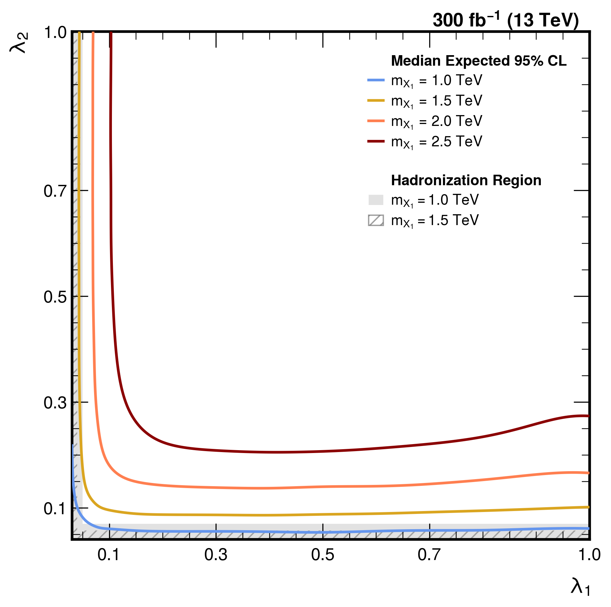
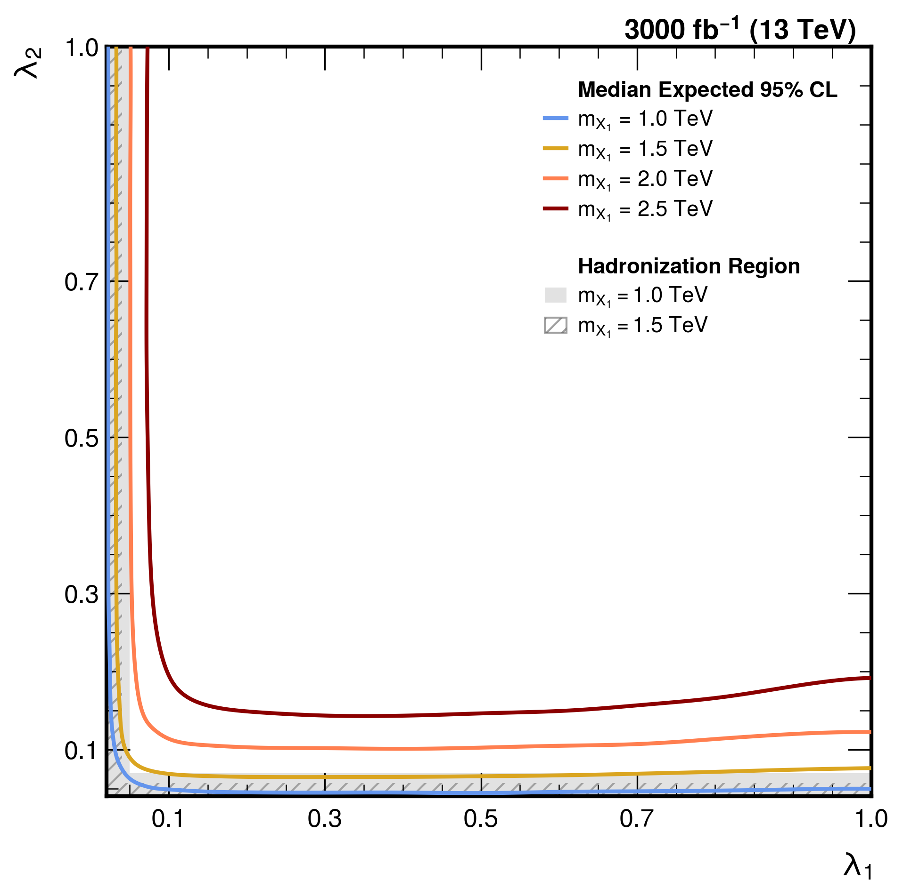
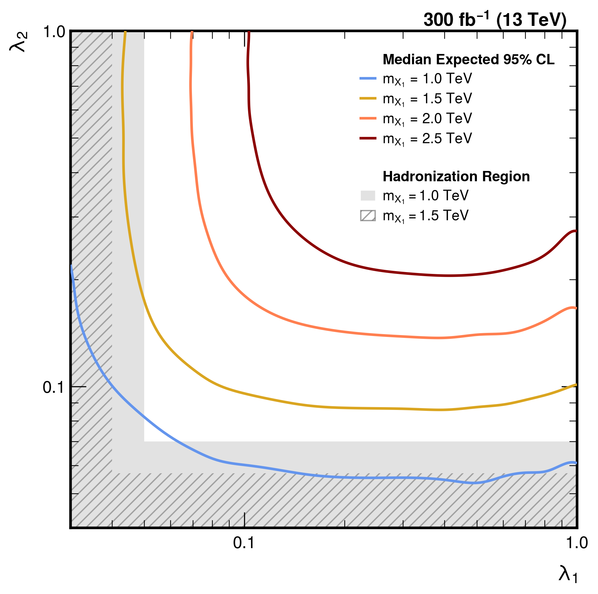
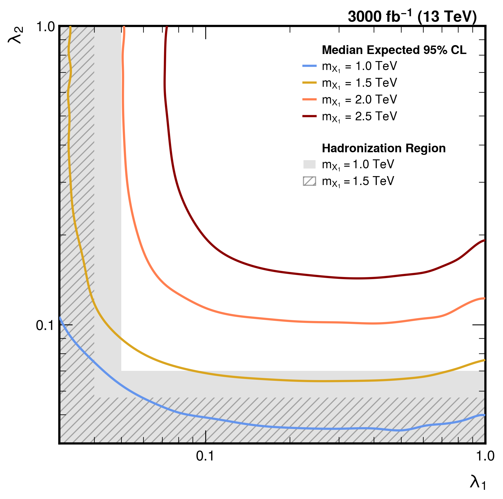

# HiggsCombine Tool

This directory contains the HiggsCombine setup and datacard-based limit-setting workflow for the b-associated monojet analysis.

---

## Contents

1. [Setup](#setup)
   - [HiggsCombine Tool Setup](#higgscombine-tool-setup)

2. [Datacard Structure](#datacard-structure)
   - [Signal Normalization](#signal-normalization)
   - [Systematic Uncertainty Modes](#systematic-uncertainty-modes)

3. [Running AsymptoticLimits](#running-asymptoticlimits)
   - [Blind Analysis](#blind-analysis)

4. [Analysis](#analysis)
   - [Step 1 — r-value extraction](#step-1--r-value-extraction)
   - [Step 2 — Exclusion Contour (XS-fit based)](#step-2--exclusion-contour-xs-fit-based)
     - [Exclusion condition](#exclusion-condition)
     - [Cross-section parametrization](#cross-section-parametrization)
     - [Efficiency interpolation](#efficiency-interpolation)
     - [Median expected 95% confidence level exclusion](#median-expected-95-confidence-level-exclusion)
   - [Step 3 — Critical Coupling Values](#step-3--critical-coupling-values)

5. [Comparison with N_sig Plane Method](#comparison-with-n_sig-plane-method)
   - [Method Differences](#method-differences)
   - [Numerical Comparison](#numerical-comparison)
   - [Log-scale Contour Comparison: Run3](#log-scale-contour-comparison:-run3)

6. [References](#references)

## Setup

### HiggsCombine Tool Setup

`CMSSW` is required.

```bash
source /cvmfs/cms.cern.ch/cmsset_default.sh
cmsrel CMSSW_14_1_0_pre4
```

Before running HiggsCombine, the following commands are required each session:

```bash
# From the repository root
source /cvmfs/cms.cern.ch/cmsset_default.sh
# From CMSSW_14_1_0_pre4/src/
cmsenv
```

---

## Datacard Structure

### Signal Normalization

The signal is normalized to the MadGraph5 LO cross section at the reference coupling point $(\lambda_1^{\rm ref}, \lambda_2^{\rm ref}) = (0.1, 0.1)$, for each $m_{X_1}$ mass point.

The datacard `rate` for signal is:

$$\mathrm{rate~sig} = \sigma_{\mathrm{ref}} \times \mathcal{L} \times 1000 \times \varepsilon_{\mathrm{ref}}$$

where:

- $\sigma_{\rm ref} = \sigma(\lambda_1^{\rm ref}, \lambda_2^{\rm ref})$ [pb] — from `src/23.XS-2Dplot/cross_sections.csv`
- $\mathcal{L}$ ($\mathrm{fb}^{-1}$) — target integrated luminosity (300 or 3000)
- $\varepsilon_{\rm ref} = \varepsilon_{\rm sel} \times \varepsilon_{\rm BDT}$ — combined selection and BDT efficiency at the reference point

The input cross sections at the reference point $(\lambda_1, \lambda_2) = (0.1, 0.1)$ are:

|$m_{X_1}$ [TeV]|$\sigma_{\rm ref}$ [pb]|$\varepsilon_{\rm ref}$|`rate_sig` ($\mathcal{L}=300~\mathrm{fb}^{-1}$)|
|:-:|:-:|:-:|-:|
|1.0|1.1688e-02|0.1323|463.8095|
|1.5|1.6016e-03|0.1198|57.5397|
|2.0|3.2885e-04|0.1322|13.0420|
|2.5|8.1617e-05|0.1374|3.3636|

Details:
- `rate_sig` values are computed from `cross_section_SG.csv` and `efficiency_SG.csv`. See `src/23.XS-2Dplot/` and `src/Efficiency-signal/` for the full tables.
- All cross-section informations for signal are organized in `src/23.XS-2Dplot/cross_section_SG.csv`
- All efficiency for 'selection' and 'bdt cut' are also organized in `/users/ujeon/2025-monojet/MONOJET-WORKSPACE/src/Efficiency-signal/efficiency.csv`

The datacard format (example: Run3, $m_{X_1}=1.0$ TeV, `stats` mode) is:

```
imax 1  number of channels
jmax 1  number of backgrounds
kmax *
----------------------------------------------------------------------
bin                      bin1
observation              -1
----------------------------------------------------------------------
bin                      bin1                bin1
process                  sig                 bkg
process                  0                   1
rate                     463.8095            4692.9513
----------------------------------------------------------------------
# signal normalized to xs_ref=... pb at (lam1=0.1, lam2=0.1), L=300 fb-1, eps_ref=...
stat_bkg        lnN     -                   1.0120
```

> `observation -1` instructs Combine to use a pre-fit Asimov dataset ($n_{\rm obs} = b_0$), ensuring a fully blind analysis.

### Systematic Uncertainty Modes

|Mode|Applied Uncertainties|
|---|---|
|`none`|None|
|`stats`|BKG statistical (lnN)|
|`sys1`|stats + signal XSEC 10% (lnN)|
|`sys2`|sys1 + JES 5% (sig+bkg, lnN)|
|`sys3`|sys2 + MET 4% (sig+bkg, lnN)|

Datacards for all modes are in `datacards/datacards_XSEC-JES-MET_noObs`.

---

## Running AsymptoticLimits

### Blind Analysis

This analysis uses a **fully blind** setup:

- `observation -1` in the datacard (Asimov: $n_{\rm obs} = b_0$, pre-fit)
- `--run blind` in Combine (enforces pre-fit Asimov, no fit to data)

The command to run AsymptoticLimits for a single datacard is:

```bash
combine -M AsymptoticLimits \
    ./datacards/datacards_XSEC-JES-MET_noObs/datacard_lumi300_mx11-0_cut0p1050_stats.txt \
    -n ".Lumi300.MX10.stats.xsfit \
    -m 1000 \
    --run blind
```

To run all mass points, luminosity scenarios, and systematic modes:

```bash
for lumi in 300 3000; do
  for mode in none stats sys1 sys2 sys3; do
    combine -M AsymptoticLimits \
        ./datacards/datacards_XSEC-JES-MET_noObs/datacard_lumi${lumi}_mx11-0_cut0p1050_${mode}.txt \
        -n .Lumi${lumi}.MX10.${mode}.xsfit -m 1000 --run blind
    combine -M AsymptoticLimits \
        ./datacards/datacards_XSEC-JES-MET_noObs/datacard_lumi${lumi}_mx11-5_cut0p1350_${mode}.txt \
        -n .Lumi${lumi}.MX15.${mode}.xsfit -m 1500 --run blind
    combine -M AsymptoticLimits \
        ./datacards/datacards_XSEC-JES-MET_noObs/datacard_lumi${lumi}_mx12-0_cut0p1440_${mode}.txt \
        -n .Lumi${lumi}.MX20.${mode}.xsfit -m 2000 --run blind
    combine -M AsymptoticLimits \
        ./datacards/datacards_XSEC-JES-MET_noObs/datacard_lumi${lumi}_mx12-5_cut0p1520_${mode}.txt \
        -n .Lumi${lumi}.MX25.${mode}.xsfit -m 2500 --run blind
  done
done
```

> The corresponding shell script is `run_asymptotic_w-blind_card-all-xsfit.sh`.
Each run produces an output ROOT file:

```
higgsCombine.Lumi{L}.MX{mx}.{mode}.xsfit.AsymptoticLimits.mH{mh}.root
```

```
Expected  2.5%: r < 0.2031
Expected 16.0%: r < 0.2699
Expected 50.0%: r < 0.3740   ← median expected, used for exclusion
Expected 84.0%: r < 0.5201
Expected 97.5%: r < 0.6913
```

The **median expected** (`Expected 50.0%`) $r$-value is used as the primary result.

Summary of median expected $r$ values for $\mathcal{L} = 300$ fb$^{-1}$:

|$m_{X_1}$ [TeV]|none|stats|sys1|sys2|sys3|
|:-:|:-:|:-:|:-:|:-:|:-:|
|1.0|0.2920|0.3740|0.3809|1.1055|1.3984|
|1.5|0.8086|0.9375|0.9531|1.3672|1.5859|
|2.0|2.0078|2.2891|2.3203|2.6953|2.9141|
|2.5|4.6094|5.1094|5.1875|5.5312|5.7344|


---

## Analysis

All analysis scripts are in `./result-fitbased/`.

### Step 1 — r-value extraction

Parse $r_{\rm up}$ (all 5 quantiles) from the ROOT output files and compute the 95% CL excluded signal yield $N_{\rm exc}$:

```bash
python3 result-fitbased/parse_results-xsfit.py
```

This script reads `outputs-xsfit/*.root` and produces `result-fitbased/results-xsfit.csv` with columns:

|Column|Description|
|---|---|
|`mx1, lumi, mode`|Identifiers|
|`xs_ref, eff_ref, rate_sig_ref`|Reference point values|
|`r_exp_m2s, r_exp_m1s, r_exp_med, r_exp_p1s, r_exp_p2s`|Quantile $r$-values|
|`N_exc_exp_med`|$N_{\rm exc} = r_{\rm up}^{\rm med} \times \sigma_{\rm ref} \times \mathcal{L} \times 1000 \times \varepsilon_{\rm ref}$|

---

### Step 2 — Exclusion Contour (XS-fit based)

```bash
python3 result-fitbased/plot_contour_fitbased.py
```

#### Exclusion condition

The 95% CL excluded signal yield at the reference point is:

$$N_{\rm exc} = r_{\rm up}^{\rm med} \times \sigma_{\rm ref} \times \mathcal{L} \times 1000 \times \varepsilon_{\rm ref}$$

A coupling point $(\lambda_1, \lambda_2)$ is **excluded** when:

$$\sigma(\lambda_1, \lambda_2) \times \varepsilon(\lambda_1, \lambda_2) \times \mathcal{L} \times 1000 > N_{\rm exc}$$

The exclusion boundary (contour) is the equality condition.

#### Cross-section parametrization

$$\sigma(\lambda_1, \lambda_2) = \frac{A \cdot \lambda_1^2 \cdot \lambda_2^2}{4.0 \cdot \lambda_1^2 + \lambda_2^2}$$

$A$ is determined per $m_{X_1}$ by iterative fitting to MG5 LO values (threshold 10%):

|$m_{X_1}$ [TeV]|$A$|
|:-:|:-:|
|1.0|5.4682|
|1.5|0.81048|
|2.0|0.16842|
|2.5|0.042582|

Cross-section distribution over the $(\lambda_1, \lambda_2)$ plane for each mass point:

| $m_{X_1} = 1.0$ TeV | $m_{X_1} = 1.5$ TeV |
|---|---|
|  |  |

| $m_{X_1} = 2.0$ TeV | $m_{X_1} = 2.5$ TeV |
|---|---|
|  |  |

#### Efficiency interpolation

```python
from scipy.interpolate import RectBivariateSpline
spline = RectBivariateSpline(lam1_vals, lam2_vals, eff_matrix, kx=3, ky=3)
```

BDT cut values per $m_{X_1}$:

|$m_{X_1}$ [TeV]|BDT cut|
|:-:|:-:|
|1.0|0.105|
|1.5|0.135|
|2.0|0.144|
|2.5|0.152|

Signal efficiency over the $(\lambda_1, \lambda_2)$ plane (all mass points, after BDT cut):


Output plots are saved to `result-fitbased/plots/contour_lumi{L}_{mode}_{log|lin}.pdf`.

#### Median expected 95% confidence level exclusion

All plots are stored in `result-fitbased/plots/`.  
Example contour plots for the `stats` mode are shown below.

| 300 $\mathrm{fb}^{-1}$ (linear) | 3000 $\mathrm{fb}^{-1}$ (linear) |
|---|---|
|  |  |

| 300 $\mathrm{fb}^{-1}$ (log) | 3000 $\mathrm{fb}^{-1}$ (log) |
|---|---|
|  |  |

---

### Step 3 — Critical Coupling Values

To quote a single number per mass point, 1D slices through the contour are taken by fixing one coupling at $\lambda = 0.5$ and solving for the critical value of the other.

Example for $\mathcal{L} = 300~\mathrm{fb}^{-1}$, `stats` mode:

|$m_{X_1}$ [TeV]|$\lambda_{1,\mathrm{crit}}$|$\lambda_{2,\mathrm{crit}}$|
|:-:|:-:|:-:|
|1.0|<0.030|0.054|
|1.5|0.043|0.087|
|2.0|0.070|0.140|
|2.5|0.106|0.207|

Example for $\mathcal{L} = 3000~\mathrm{fb}^{-1}$, `stats` mode:

|$m_{X_1}$ [TeV]|$\lambda_{1,\mathrm{crit}}$|$\lambda_{2,\mathrm{crit}}$|
|:-:|:-:|:-:|
|1.0|<0.030|0.044|
|1.5|0.033|0.066|
|2.0|0.051|0.102|
|2.5|0.073|0.146|

Full results across all luminosity and systematic scenarios are in `result-fitbased/lam_crit_summary.csv`.

Critical $\lambda_2$ values as systematic uncertainties are added incrementally ($\mathcal{L} = 300$ fb$^{-1}$):

|Uncertainty|1.0 TeV|1.5 TeV|2.0 TeV|2.5 TeV|
|---|:-:|:-:|:-:|:-:|
|stats only|<0.06|<0.09|<0.14|<0.21|
|stats + xsec (10%)|<0.06|<0.09|<0.15|<0.21|
|stats + xsec + JES (5%)|<0.10|<0.11|<0.16|<0.22|
|stats + xsec + JES + MET (4%)|<0.11|<0.12|<0.16|<0.22|

Critical $\lambda_2$ values as systematic uncertainties are added incrementally ($\mathcal{L} = 3000$ fb$^{-1}$):

|Uncertainty|1.0 TeV|1.5 TeV|2.0 TeV|2.5 TeV|
|---|:-:|:-:|:-:|:-:|
|stats only|<0.05|<0.07|<0.11|<0.15|
|stats + xsec (10%)|<0.05|<0.07|<0.11|<0.15|
|stats + xsec + JES (5%)|<0.10|<0.10|<0.13|<0.17|
|stats + xsec + JES + MET (4%)|<0.11|<0.11|<0.14|<0.17|

---

## Comparison with N_sig Plane Method

The original approach ([`CombineTool/README-signalYieldBased.md`](README-signalYieldBased.md)) also uses HiggsCombine r-values, but derives the exclusion contour differently.

### Method Differences

| | N_sig plane (original) | XS-fit (this work) |
|---|---|---|
| $N_s(\lambda_1,\lambda_2)$ source | BDT CSV — MC simulation grid | $\sigma_{\rm analytic}(\lambda_1,\lambda_2) \times \varepsilon_{\rm spline}(\lambda_1,\lambda_2)$ |
| $\sigma$ parametrization | None (MC values read directly) | $A \cdot \lambda_1^2 \lambda_2^2 / (4\lambda_1^2 + \lambda_2^2)$ |
| Exclusion condition | $N_s(\lambda_1,\lambda_2) > r_{\rm up} \times N_s^{\rm nominal}$ | $\sigma \times \varepsilon \times \mathcal{L} \times 1000 > r_{\rm up} \times \sigma_{\rm ref} \times \varepsilon_{\rm ref} \times \mathcal{L} \times 1000$ |
| Contour drawing | `ax.contour(ZI, levels=[s_up])` on spline-interpolated MC plane | analytic boundary solved from exclusion condition |
| Blinding | `observation 46930` (unblinded) | `observation -1` + `--run blind` (Asimov) |

### Numerical Comparison

Critical coupling values (`stats` mode, $\mathcal{L} = 300~\mathrm{fb}^{-1}$, fixed opposite coupling at 0.5):

| $m_{X_1}$ [TeV] | $\lambda_{1,\rm crit}$ (N_sig plane) | $\lambda_{1,\rm crit}$ (XS-fit) | $\lambda_{2,\rm crit}$ (N_sig plane) | $\lambda_{2,\rm crit}$ (XS-fit) |
|:-:|:-:|:-:|:-:|:-:|
| 1.0 | <0.030 | <0.030 | 0.054 | 0.054 |
| 1.5 | 0.043 | 0.043 | 0.088 | 0.087 |
| 2.0 | 0.072 | 0.070 | 0.139 | 0.140 |
| 2.5 | 0.109 | 0.106 | 0.204 | 0.207 |

The results of the two methods agree within 1% → This confirms that the analytical $\sigma$ model and $\varepsilon$ spline interpolation are sufficiently accurate.

### Log-scale Contour Comparison: Run3

Log-scale contour plots for the `stats` mode, comparing the two luminosity scenarios side by side:

| 300 $\mathrm{fb}^{-1}$, $N_s$ | 300 $\mathrm{fb}^{-1}$, XS-fit |
|---|---|
|  |  |

The higher luminosity (3000 fb⁻¹) visibly tightens the exclusion contour, pushing sensitivity toward smaller coupling values. The log scale reveals the shape of the exclusion boundary at low couplings where the linear scale compresses the structure.

---

## References

- HiggsAnalysis-CombinedLimit: https://cms-analysis.github.io/HiggsAnalysis-CombinedLimit/latest/
- Blind analysis: https://cms-analysis.github.io/HiggsAnalysis-CombinedLimit/latest/part5/longexerciseanswers/#b-running-combine-for-a-blind-analysis
- Asymptotic formulae: Cowan et al., Eur.Phys.J. C71 (2011) 1554, [arXiv:1007.1727](https://arxiv.org/abs/1007.1727)
- Signal cross sections: `src/23.XS-2Dplot/cross_section_SG.csv`
- Signal efficiency: `src/Efficiency-signal/efficiency_SG.csv`


## Appendix 

### Cross-section planes

### Efficiency check

